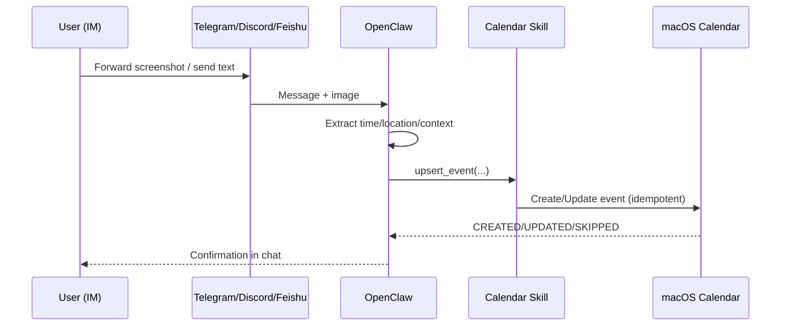
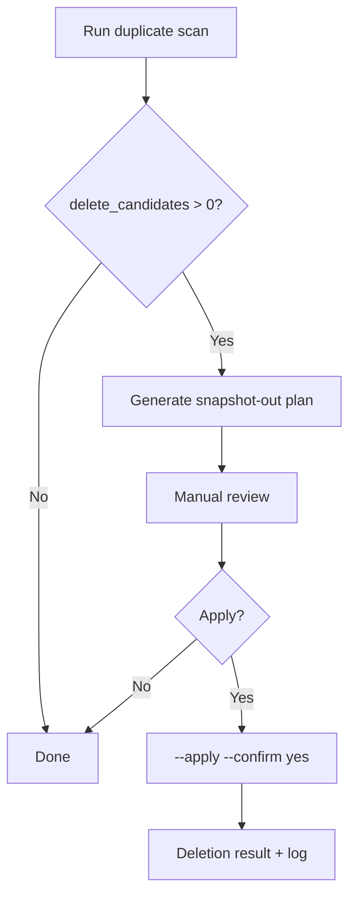
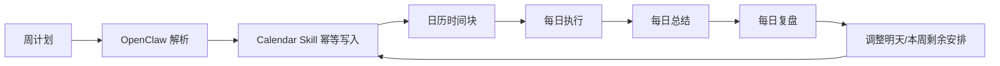
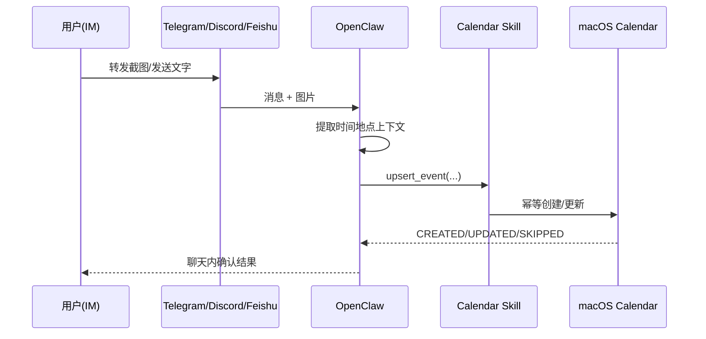
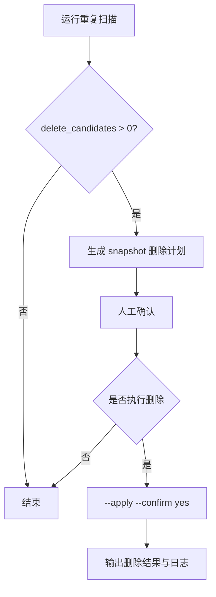

# macos-calendar-assistant

> Turn planning, execution, and daily review into one continuous calendar workflow.

English | [中文](#中文)

---

## English

## Why this skill exists
Most calendar tools stop at "add event." They do not help you close the loop between:
- weekly planning,
- daily execution,
- daily summary,
- next-day / next-week adjustment.

This skill is built for that loop.

## Who this is for
Especially useful for:
1. **One Person Company (OPC)** founders
2. People with strong planning / schedule management needs

If your work changes fast and plans need constant adjustment, this skill helps keep your calendar clean, current, and actionable.

## User story (real-world workflow)
A typical user (like Bryant):
1. Writes a weekly plan every Monday
2. Uses OpenClaw + AI to break it into concrete calendar blocks
3. Writes a daily summary at the end of each day
4. Runs a daily review to adjust tomorrow and rebalance the rest of the week

With this skill, planning + summary + schedule sync happen in one system, with full traceability.
You no longer need to manually juggle multiple tools for daily planning maintenance.

## What problems it solves
- Duplicate events from repeated AI/tool calls
- Plans drifting away from real execution
- Daily review not reflected back into calendar
- Hard-to-maintain weekly adjustments

## OpenClaw + IM integration
This skill works especially well as a calendar execution layer behind OpenClaw.
You can manage schedules directly from IM conversations (Telegram / Discord / Feishu / iMessage / Slack, etc.) instead of manually opening Calendar every time.

### Screenshot-to-Schedule scenario
- Forward a screenshot (group notice, event poster, booking page, chat screenshot)
- OpenClaw extracts time/location/context
- This skill upserts the event (no duplicate spam)
- You refine in chat: "extend to 14:00", "move to Friday night", "add 30-min reminder"

## Visual workflow






## Key capabilities
- Idempotent event write (`CREATED` / `UPDATED` / `SKIPPED`)
- Calendar/event listing for conflict checks
- Alarm updates by UID
- Duplicate detection + safe cleanup
- Daily duplicate-check reminder via cron

## Requirements
- macOS
- Python 3.9+
- Swift (Xcode Command Line Tools)
- Calendar permission granted to terminal/host process

## Quick start
```bash
cd scripts
./install.sh
```

## Typical daily usage
```bash
# 1) Environment check
python3 scripts/env_check.py

# 2) Upsert plan blocks (safe, no accidental duplicates)
python3 scripts/upsert_event.py \
  --title "Deep work: Product positioning" \
  --start "2026-03-06T10:00:00+08:00" \
  --end "2026-03-06T11:30:00+08:00" \
  --calendar "产品" \
  --notes "Weekly goal alignment" \
  --alarm-minutes 15

# 3) End-of-day check for calendar hygiene
python3 scripts/calendar_clean.py --start "2026-03-01T00:00:00+08:00" --end "2026-03-08T23:59:59+08:00"

# 4) Apply cleanup only when reviewed (double confirmation)
python3 scripts/calendar_clean.py --start "..." --end "..." --apply --confirm yes --snapshot-out ./delete-plan.json
```

## Validation
```bash
scripts/smoke_test.sh
python3 scripts/regression_test.py
```

## Uninstall
```bash
cd scripts
./uninstall.sh
```

---

## 中文

## 这个 Skill 解决什么问题
大多数日历工具只负责“加事件”，但不负责把下面这条链路串起来：
- 周计划
- 每日执行
- 每日总结
- 复盘后对后续计划的修正

这个 Skill 的核心就是把这条链路打通。

## 适合谁
特别适合：
1. **一人公司（OPC）**
2. 有明确计划习惯、日程管理需求强的人

如果你的工作节奏变化快、计划需要天天微调，这个 Skill 会很有价值。

## 用户故事（按你的场景）
以你这样的用户为例：
1. 每周写周计划
2. 用 OpenClaw 让 AI 把周计划拆成可执行日程
3. 每天结束写总结
4. 做每日复盘，并把复盘结果同步到后续日程

这样就能形成“计划—执行—总结—修正”的闭环，并且全过程可追踪。
不再需要在多个工具之间手动同步。

## OpenClaw + IM 集成
这个 Skill 非常适合作为 OpenClaw 背后的日历执行层。
你可以直接在 IM 对话里管理日程（Telegram / Discord / Feishu / iMessage / Slack 等），不用每次手动打开 Calendar。

### 截图转日程（Screenshot-to-Schedule）
- 转发截图（群通知、活动海报、预约页面、聊天截图）
- OpenClaw 提取时间/地点/上下文
- 该 Skill 幂等写入日历（不重复刷事件）
- 你在聊天里继续调整："延长到14:00"、"改到周五晚上"、"提前30分钟提醒"

## 可视化流程






## 核心能力
- 幂等写入（`CREATED` / `UPDATED` / `SKIPPED`）避免重复添加
- 日历/事件读取（冲突检查）
- 通过 UID 更新提醒
- 重复事件检测与安全清理
- 每日自动检查（cron 提醒）

## 环境要求
- macOS
- Python 3.9+
- Swift（Xcode Command Line Tools）
- 终端/宿主进程已授予 Calendar 权限

## 快速开始
```bash
cd scripts
./install.sh
```

## 日常使用示例
```bash
# 1) 环境自检
python3 scripts/env_check.py

# 2) 幂等写入计划（避免重复）
python3 scripts/upsert_event.py \
  --title "深度工作：产品定位" \
  --start "2026-03-06T10:00:00+08:00" \
  --end "2026-03-06T11:30:00+08:00" \
  --calendar "产品" \
  --notes "与周目标对齐" \
  --alarm-minutes 15

# 3) 每日复盘前检查日程卫生
python3 scripts/calendar_clean.py --start "2026-03-01T00:00:00+08:00" --end "2026-03-08T23:59:59+08:00"

# 4) 审核后再清理（双保险）
python3 scripts/calendar_clean.py --start "..." --end "..." --apply --confirm yes --snapshot-out ./delete-plan.json
```

## 测试
```bash
scripts/smoke_test.sh
python3 scripts/regression_test.py
```

## 卸载
```bash
cd scripts
./uninstall.sh
```
