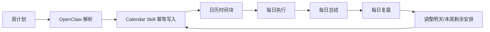
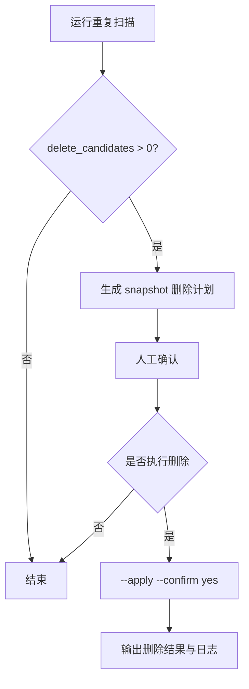

# macos-calendar-assistant

> 我用这个 Skill，把「周计划 → 每日执行 → 每日总结 → 日程调整」做成一个闭环。

中文 | [English](#english)

---

## 中文

## 我为什么做这个 Skill
这个 Skill 的背景是：我前段时间做过一个叫 **CalendarAI** 的客户端，已经验证了“调用 AI 做日程增删改查”这件事是可行的。

我也系统研究过一批日程与智能排程产品，包括 **Toki / Calendly / Clockwise / Motion / Amie** 等。
它们分别在对话交互、约会链接、团队排程、自动重排与体验设计上给了我不同启发。
这些研究给了我一个很明确的结论：
真正高频、自然、可持续的日程管理，不只是“能建事件”，而是要把管理动作放进用户每天已经在用的沟通场景里。

所以在我开始重度使用 OpenClaw 后，我更确认了一点：
**直接在 IM 对话里管理日程，再同步到系统日历**，比单独做一个客户端更 agentic-friendly，也更 human-friendly。

我最终做这个 `macos-calendar-assistant`，就是为了把这条链路打通：
- 周计划怎么落地到每天
- 每天执行后怎么复盘
- 复盘结果怎么回写到后续日程

让日程不只是记录，而是持续迭代的执行系统。

## 我主要怎么用
我自己的典型工作流：
1. 每周先写周计划
2. 用 OpenClaw + AI 把计划拆成可执行时间块
3. 每天结束写总结
4. 根据复盘结果直接调整后续日程

这样可以形成“计划—执行—总结—修正”的闭环。

## 我把它接到 IM 里怎么用
这个 Skill 可以配合 OpenClaw 直接接入 IM（Telegram / Discord / Feishu / iMessage / Slack 等）。
我可以在聊天里直接说“加个日程”“延长到14:00”“改到周五晚上”，不需要来回切 App。

### 截图转日程（我最常用）
我会直接转发截图（群通知、活动海报、聊天截图、预约页面等）：
1. OpenClaw 先识别时间/地点/上下文
2. Skill 幂等写入 Calendar（避免重复）
3. 我在聊天里继续微调（时间、地点、提醒）

## 我解决了哪些痛点
- AI 重复写入导致的日历污染
- 计划和真实执行脱节
- 每日复盘无法同步到后续安排
- 一周内频繁调整成本高

## 核心能力
- 幂等写入（`CREATED` / `UPDATED` / `SKIPPED`）
- 日历/事件读取（冲突检查）
- 按 UID 设置提醒
- 重复检测与安全清理（`--apply --confirm yes`）
- 每日自动检查（cron）

## 可视化流程





## 环境要求
- macOS
- Python 3.9+
- Swift（Xcode Command Line Tools）
- 终端/宿主进程已授予 Calendar 权限

## 快速开始
```bash
cd scripts
./install.sh
```

## 常用命令
```bash
# 环境自检
python3 scripts/env_check.py

# 幂等创建/更新
python3 scripts/upsert_event.py \
  --title "深度工作：产品定位" \
  --start "2026-03-06T10:00:00+08:00" \
  --end "2026-03-06T11:30:00+08:00" \
  --calendar "产品" \
  --notes "与周目标对齐" \
  --alarm-minutes 15

# 重复扫描（仅检查）
python3 scripts/calendar_clean.py --start "2026-03-01T00:00:00+08:00" --end "2026-03-08T23:59:59+08:00"

# 重复清理（双保险）
python3 scripts/calendar_clean.py --start "..." --end "..." --apply --confirm yes --snapshot-out ./delete-plan.json
```

## 测试
```bash
scripts/smoke_test.sh
python3 scripts/regression_test.py
```

## 卸载
```bash
cd scripts
./uninstall.sh
```

---

## English

This skill is my calendar execution layer for OpenClaw.
I use it to keep a tight loop between weekly planning, daily execution, daily summary, and schedule adjustments.

### What it helps me do
- Write/update events idempotently (`CREATED` / `UPDATED` / `SKIPPED`)
- Detect conflicts and duplicates
- Clean duplicates safely with explicit confirmation
- Operate from chat workflows (including screenshot-to-schedule)

### Typical flow
1. I create a weekly plan.
2. OpenClaw turns it into calendar blocks.
3. I run daily summaries and reviews.
4. I adjust upcoming blocks in chat.

### Setup
```bash
cd scripts
./install.sh
```

### Common commands
```bash
python3 scripts/env_check.py
scripts/smoke_test.sh
python3 scripts/regression_test.py
```
